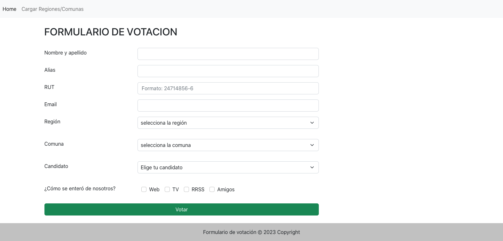

# Sistema de Votación
Proyecto Formulario de Votación - Utilizando PHP &amp; MySQL

## Requisitos del proyecto:
1. PHP 8.2.0
2. MySQL 5.7.39
3. Servidor Http Apache 

## Herramientas utilizadas
1. VSCode (Editor )
2. PHPMyAdmin5 (Administrador DB)
3. Miro (Diseño de DB)
4. Bootstrap 5 (Framework CSS)

## Qué resuelve?
En un sistema de votación, se requiere validar varias varios puntos, este sistema valida cada punto del formulario de votación, aplicando las restricciones según los requisitos del cliente.

## Formulario de votación
```md
    
```

## Requerimientos del proyecto
- Validar que no haya respuestas vacias
- Que valide que el 
- 
## Cómo descargar el proyecto?
```
git clone git@github.com:zshlatam/sistemadeVotacion.git

```
## Desarrollo de la base de datos

## Uso
Una vez descargado el proyecto, Se debe crear una DB y posteriormente ejecutar un script de la carpeta /scritpsDatabase
Cabe destacar que ambos Script de esta carpeta poseen las mismas tablas de la db 
